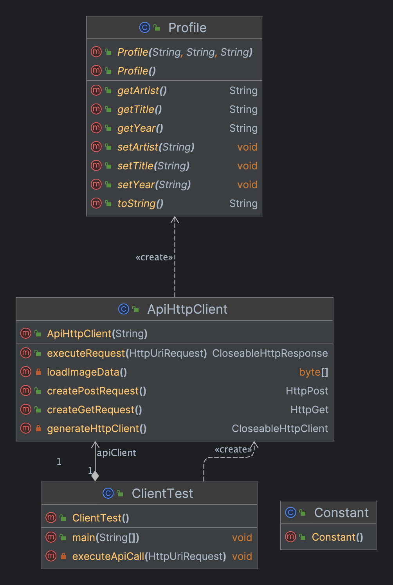
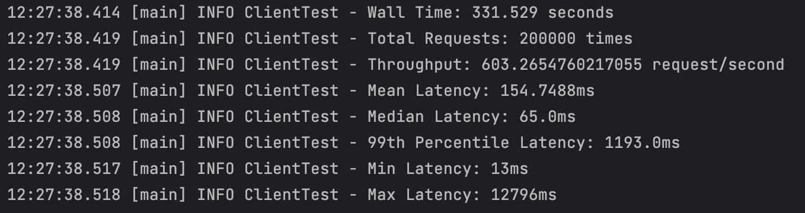

# CS6650-Assignment1-Xiaorui Shen

## Client (Part 1) Design Description

### 1. Dependencies

**Logging:**

- **slf4j (version 2.0.7)**: A logging facade for Java. It allows for various logging frameworks to be plugged in without changing the application's code.
- **logback (version 1.4.5)**: An logging framework and a successor to the popular log4j project. It's used to log error and informational messages from the application.

**HTTP Communication:**

- **apache httpclient (version 4.5.13)**: A HTTP client library for Java. It provides functionalities for communication with HTTP servers, including sending and receiving data.
- **apache httpmime (version 4.5.13)**: An extension to the httpclient library. It offers enhanced support for various HTTP entities, including multipart entities, making it easier to send multipart HTTP requests.

**Data Transformation & Utilities:**

- **lombok (version 1.18.30)**: A library that helps reduce boilerplate code in Java applications using annotations. It automates the generation of getters, setters, constructors, and other common code.
- **gson (version 2.9.0)**: A Java library for converting Java objects into their JSON representation and vice-versa. It simplifies the process of handling transformation between Java objects and JSON data.

### 2. Major Classes

- **ApiHttpClient**: Handles the creation and execution of HTTP requests.
  - Methods to create different types of HTTP requests, like POST and GET.
  - It can execute given HTTP request and to have some functionality related to image data, for multipart data handling.
- **Profile**: To generate profile entity, then converted to JSON, added to POST request.
- **Constant**: To provide constant.
- **ClientTest**: The main driver or orchestrator of the client's testing process.
  - Contains a `main()` method, the entry point for execution.
  - It has methods to execute API calls and compute latency statistics, emphasizing its role in managing the testing process.

### 3. Relationships

### 4. How it works

1. **Argument Checking and Initialization**:
   - The main method first checks if it has received enough command-line arguments. If not, it logs an error and exits.
   - It then initializes some parameters and creates an `ApiHttpClient` object using the provided IP address.
2. **Initial Phase**:
   - A fixed-size thread pool (`initialExecutor`) is created with `INITIAL_THREADS` threads.
   - For each thread, a POST and GET request are prepared and submitted to the thread pool for execution.
   - Within each thread's task, the client makes `INITIAL_API_CALLS` POST and GET requests, consuming and discarding the responses. If any exception occurs, it's logged and rethrown.
   - After all tasks are submitted, it waits for the tasks to complete using `awaitTermination`.
3. **Loop Phase**:
   - Another thread pool (`loopExecutor`) is created for the loop phase with a size equal to `threadGroupSize * numThreadGroups`.
   - For each thread group, for each thread in the group, POST and GET requests are created and submitted for execution. This time, each task makes `LOOP_API_CALLS` requests.
   - After submitting tasks for a group, it waits for a specified delay before moving to the next group, except for the last group.
   - After all tasks are submitted, it waits for the tasks to complete.
4. **Reporting**:
   - After both phases are complete, it calculates and logs the total time taken (`wallTime`), the total number of requests made, and the throughput (requests per second).

------

## Client (Part 2) Design Description

### 1. Dependencies

**Logging:**

- **slf4j (version 2.0.7)**: A logging facade for Java. It allows for various logging frameworks to be plugged in without changing the application's code.
- **logback (version 1.4.5)**: An logging framework and a successor to the popular log4j project. It's used to log error and informational messages from the application.

**HTTP Communication:**

- **apache httpclient (version 4.5.13)**: A HTTP client library for Java. It provides functionalities for communication with HTTP servers, including sending and receiving data.
- **apache httpmime (version 4.5.13)**: An extension to the httpclient library. It offers enhanced support for various HTTP entities, including multipart entities, making it easier to send multipart HTTP requests.

**Data Transformation & Utilities:**

- **lombok (version 1.18.30)**: A library that helps reduce boilerplate code in Java applications using annotations. It automates the generation of getters, setters, constructors, and other common code.
- **gson (version 2.9.0)**: A Java library for converting Java objects into their JSON representation and vice-versa. It simplifies the process of handling transformation between Java objects and JSON data.

### 2. Major Classes

- **ApiRecord**: Encapsulate details related to individual API requests.
  - It keeps track of the request's start time, type (e.g., POST or GET), latency, and the response code received.
- **ThreadUtility**: Manage thread execution for the client, especially handling different phases of thread execution.
  - Methods to generate thread executors, both for the initial phase and for a loop phase, suggesting differentiated handling or configuration for different stages of execution.
- **CSVUtility**: Be responsible for operations related to CSV file writing, which likely includes storing test results or logs.
  - Methods to initialize a CSV writer, write records to the CSV, and close the writer after operations are complete.
- **ApiHttpClient**: Handles the creation and execution of HTTP requests.
  - Methods to create different types of HTTP requests, like POST and GET.
  - It can execute given HTTP request and to have some functionality related to image data, for multipart data handling.
- **Profile**: To generate profile entity, then converted to JSON, added to POST request.
- **Constant**: To provide constant.
- **ClientTest**: The main driver or orchestrator of the client's testing process..
  - Contains a `main()` method, the entry point for execution.
  - It has methods to execute API calls and compute latency statistics, emphasizing its role in managing the testing process.

### 3. Relationships

### 4. How it works

The primary execution flow is as follows:

1. **Arguments Check**:
   - Ensures that the program has the necessary command-line arguments to proceed.
2. **Initialize Variables**:
   - Set up the necessary parameters based on the command-line arguments provided.
3. **Initial Phase**:
   - Uses a fixed number of threads (`INITIAL_THREADS`) to perform a set number of API calls (`INITIAL_API_CALLS`). This phase likely serves as a warm-up or preparatory phase for the main testing.
4. **Loop Phase**:
   - This is the primary testing phase. It loops over multiple thread groups, each making a set number of API calls (`LOOP_API_CALLS`). Results are written to a CSV file during this phase. There's also a delay between subsequent thread groups to simulate varied load on the server.
5. **Calculating & Logging Statistics**:
   - After the testing phases, the wall time, total requests, and throughput are computed and logged.
   - Latency statistics like mean, median, 99th percentile, min, and max latencies are then calculated and logged.

---

## Client (Part 1) Test Result

### Throughput Comparison

The following plot compares the throughput for the tests between the two servers:

This graph is a side-by-side bar chart that compares the throughput (measured in Requests/sec) achieved by clients implemented in Java and Go under varying loads.

**X-Axis (Load):** The x-axis represents the load categories, which are labeled as "10x10", "10x20", and "10x30". These are likely indicative of some configuration or parameters (e.g., threads x operations).

**Y-Axis (Throughput in Requests/sec):** The y-axis represents the throughput achieved, ranging from 0 to a little over 600 requests per second.

### Test Outputs

The outputs for each of the 6 tests are as follows:

#### 1. Test 1 (threadGroupSize = 10, numThreadGroups = 10, delay = 2):

​										**Figure 1:** Test for Java. 

​										**Figure 2:** Test for Go. 

#### 2. Test 2 (threadGroupSize = 10, numThreadGroups = 20, delay = 2):

​										**Figure 1:** Test for Java. 

​										**Figure 2:** Test for Go. 

#### 3. Test 3 (threadGroupSize = 10, numThreadGroups = 30, delay = 2):

​										**Figure 1:** Test for Java. 

​										**Figure 2:** Test for Go. 

------

## Client (Part 2) Test Result

Run the client following the same steps as in Part 1.

### Performance Statistics

The outputs for each test run, along with the specified performance statistics at the end, are as follows:

#### 1. Test 1 (threadGroupSize = 10, numThreadGroups = 10, delay = 2):

​										**Figure 1:** Test for Java. 

​										**Figure 2:** Test for Go. 

#### 2. Test 2 (threadGroupSize = 10, numThreadGroups = 20, delay = 2):

​										**Figure 1:** Test for Java. 

​										**Figure 2:** Test for Go. 

#### 3. Test 3 (threadGroupSize = 10, numThreadGroups = 30, delay = 2):

​										**Figure 1:** Test for Java. 

​										**Figure 2:** Test for Go. 

### Throughput Over Time

The following plot displays the throughput over time for a single test (threadGroupSize = 10, numThreadGroups = 30, delay = 2):

    
    

